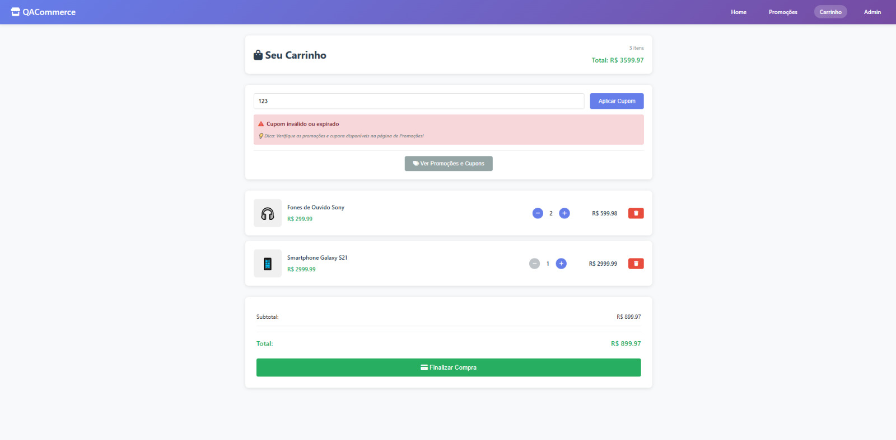
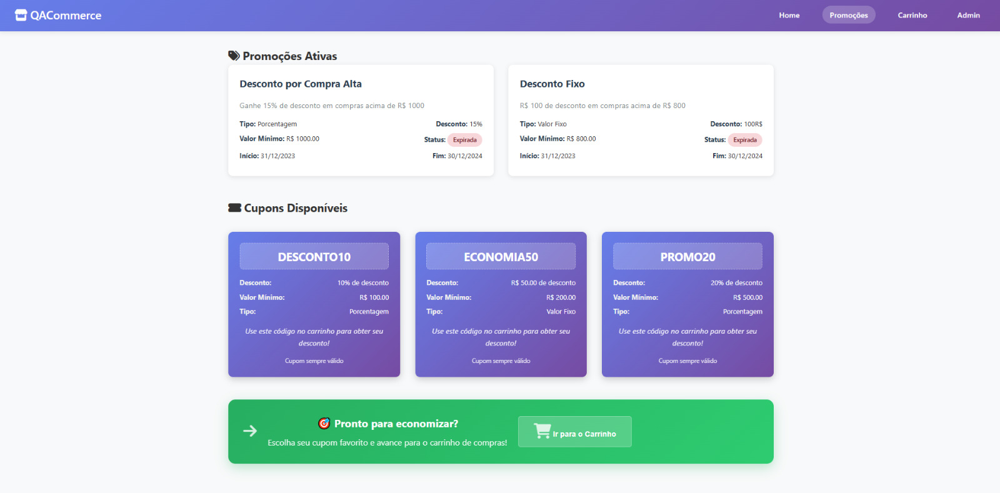

# QACommerce - Academic Portfolio

This repository is part of an **academic portfolio** developed during **Julio de Lima's Mentorship 2.0**, focused on **Software Quality Assurance (QA)**.  

The project simulates a complete e-commerce with shopping cart, coupons and promotions, being used to practice requirements gathering, test planning, test case execution, defect tracking and test automation.

## **About the Project**

**QACommerce** is an e-commerce web application developed specifically to demonstrate Quality Assurance competencies, including:

- ✅ **Functional application** with complete shopping cart
- ✅ **Coupon system** and automatic promotions  
- ✅ **Responsive interface** for desktop, tablet and mobile
- ✅ **Admin panel** for promotions management
- ✅ **Intentional bugs** to demonstrate detection skills
- ✅ **Complete automation** with Cypress

---

## 📸 **Application Screenshots**

### 🏠 **Home Page**

*Main marketplace with product grid and navigation*

### 🛒 **Shopping Cart**  

*Cart management with coupon system and total calculation*

### 🎯 **Promotions & Coupons**

*Active promotions and available discount coupons*

### ⚙️ **Admin Panel**

*Administrative interface for promotions management*

## 🎥 **Demo Video**

*Click to watch the full application demonstration*

> 🔗 **Video Link:** [QACommerce Demo on Loom](https://www.loom.com/share/659354bf544e48b9a5ad612884d7b52b?sid=e6d244e5-6786-41a1-b976-3589a2182ff0)

---

## **Technologies Used**

### **Frontend:**
- **HTML5** - Semantic application structure
- **CSS3** - Responsive and modern styling
- **JavaScript ES6+** - Business logic and interactivity

### **Test Automation:**
- **Cypress** - E2E automation framework
- **GitHub Actions** - CI/CD pipeline for automatic execution

### **Storage:**
- **In-Memory** - All data is stored in JavaScript arrays/objects
- **No database** - Pure frontend application for demonstration

---

## **Intentional Bugs (For Demonstration)**

The project includes purposefully implemented bugs to demonstrate defect detection and documentation skills:

### **GitHub Issues:**
- **[DEFECT #001: Coupon Validation Bypass](https://github.com/camilagomo/camila-portifolio/issues/3)**  
  *Coupons are accepted even below the required minimum value*

- **[DEFECT #002: Cart Total Calculation Error](https://github.com/camilagomo/camila-portifolio/issues/4)**  
  *Incorrect total calculation when there are multiple different products*

---

## **QA Documentation**
- [Test Plan](https://github.com/camilagomo/camila-portifolio/wiki/Test%E2%80%90plan:-Shopping-Cart-&-Promotions-Requirements)
- [Test Cases](https://github.com/camilagomo/camila-portifolio/wiki/Test-Cases)

---

## **Cypress**
- [How to use](cypress/README.md)
